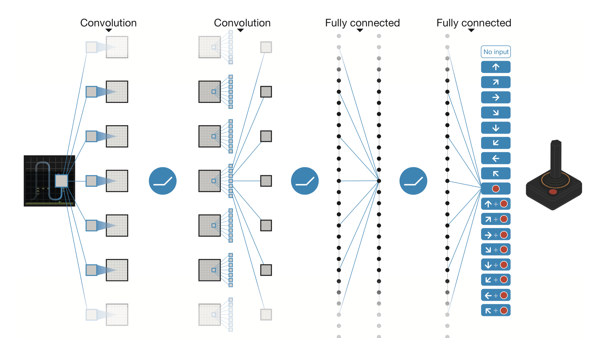
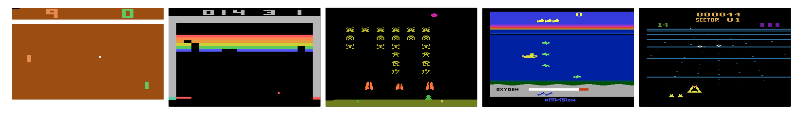

# deep-q-learning

PyTorch omplementation of DeepMind's **_Human-level control through deep reinforcement learning_** paper [(link)](https://storage.googleapis.com/deepmind-data/assets/papers/DeepMindNature14236Paper.pdf).

This research project proposes an general algorithm capable of learning how to play several popular **Atari** videogames, with no previous knowledge. It consists of an innovative implementation of a [Q-Learning](https://en.wikipedia.org/wiki/Q-learning) algorithm, which can find an optimal action-selection policy for any given finite Markov decision process. Such implementation uses a Deep Convolutional Neural Network to approximate the expected reward of every single states (named __Q-Values__), given a pixel-based representation of the current state of the videogame.

The name given to the usage of a Deep Neural Network in Reinforcement learning context is **Deep Reinforcement Learning**, and the name of doing Q-learning with a Deep Neural Network is **Deep Q Learning**.

The proposed implementation is found in this repository. Also, this _readme_ file contains an explanation of the paper's proposal.

## Model

### Input Representation

1. Each image frame in RGB is converted into it's [luminosity's representation](https://stackoverflow.com/questions/596216/formula-to-determine-brightness-of-rgb-color), which reduces it to 2-dimensions.
2. Resulting images are rezised into a square image with size 84 x 84.
3. The tensor containing a sequence of the last 4 processed frames is used as input for the Deep Convolutional Neural Network. Such tensor has size (4 x 84 x 84).

### Neural Network
1. The neural network contains a sequence of **three convolutional layers**, each followed by a [Rectifier Linear Unit (ReLU)](https://en.wikipedia.org/wiki/Rectifier_(neural_networks)) layer.
2. The **output** of the last hidden layer is **flattened into a 1-dimensional** vector, which is used as the first layer of a fully-connected neural network.
3. The **first layer** of the fully-connected network is connected to a single hidden layer, with an additional ReLU.
4. The **output layer** has multiple outputs, each one for each possible action that the agent has.

This approach has several advantages over standard online Q-learning. First, each step of experience is potentially used in many weight updates, which allows for greater data efficiency. Second, learning directly from consecutive samples is inefficient, owing to the strong correlations between the samples; randomizing the samples breaks these correla- tions and therefore reduces the variance of the updates. Third, when learning on- policy the current parameters determine the next data sample that the parameters are trained on.

It is important to clarify that the neural network is not trained on the sequentially obtained inputs generated by playing the game, but rather on randomly sampled transitions/experiences from a data structure named **Replay Memory**, which improves learning performance by: not allowing the network to learn from correlations, and also permitting efficient data usage with the reuse of previous experiences.

Quoting the original paper:

> This approach has several advantages over standard online Q-learning. First, each step of experience is potentially used in many weight updates, which allows for greater data efficiency. Second, learning directly from consecutive samples is inefficient, owing to the strong correlations between the samples; randomizing the samples breaks these correlations and therefore reduces the variance of the updates. Third, when learning on-policy the current parameters determine the next data sample that the parameters are trained on.

## Algorithm

### __Deep Q-Learning with Experience Replay__

Pseudocode for the Q-Learning algorithm which uses the previously mentioned model is presented next.

Following conventions are important to understand the pseudo-code:

- __M__: Number of episodes to train the learning agent.
- __sᵢ__: Environment/game frame at step i.
- __T__: Maximum number of steps (time limit) that the agent has in the current episode.
- __𝑄()__: Neural network that learns to approximate the real 'Q value' for every transition. 
- __^𝑄\_()__: Copy of the previous neural network, which is used to calculate as the 'target values'. It is used to calculate the prediction error, and backpropagate the network. Every *C* steps it is updated as a copy of the network 𝑄.
- __φ__: Mapping function that takes a sequence of images and transforms it into an input representation (see *input representation* above).
- __D__: Replay memory. Contains transitions (φᵢ ̟₁ ,a,r,φᵢ ̟₂) that are randomly sampled to train the network.

**Pseudo-code:**

## Code

**NOTE:** Code will run in GPU if CUDA is available, otherwise it will run in CPU :)

Code is structured in different modules. The most relevant classes will be explained next:

1. **main.py:** It contains the main execution thread of the program. This file is where the main algorithm is coded (see *algorithm* above). It uses functionality found in other classes, which will be explained next.
2. **utils/models.py:** This is where the relevant data structures are defined as classes. 
The first data structure is named **History**, and it contains the list of the (four) most recent frames 'seen' by the agent. It is used to extract the input representation for the model. 
Second data structure is named **Replay Memory**, which is the model where the agent stores all of its experiences, which are later on sampled for training.
3. **utils/net.py:** Contains all the code related to the Neural Networks used in this project. Specifically, it contains the definition of the Convolutional Neural Network described above. It also contains functionality such as `gradient_descent()`, `Q_values()`, `Q_targets()` which use the network for approximating the expected rewards, or optimize the network´s weights.
4. **utils/learn.py:** Contains e-greedy policy used to train the network.
5. **utils/processing.py:** This file containse the code used to transform the image frames into the input representations for the neural networks, as described above.

More details coming soon...
## Experiments

For the moment, only the _Pong_ videogame has been tested, results will be uploaded soon.

## References
_[1] Mnih, V. et al. Human-level control through deep reinforcement learning. Nature 518, 529–533 (2015)._

_[2] Mnih, V., Kavukcuoglu, K., Silver, D., Graves, A., Antonoglou, I., Wierstra, D., and Riedmiller, M. (Dec 2013). Playing Atari with deep reinforcement learning. Technical Report arXiv:1312.5602 [cs.LG], Deepmind Technologies._
